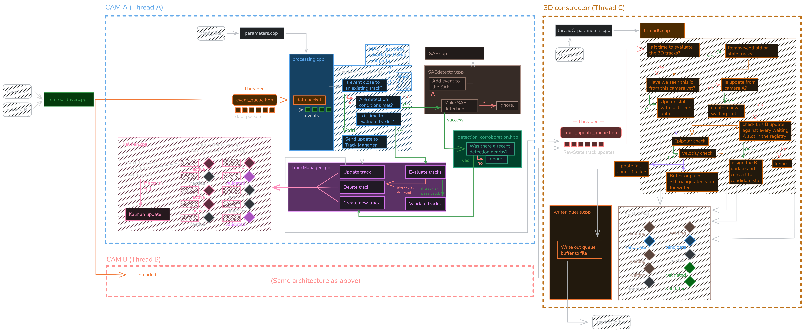

<a name="top"></a>

# Real-time Asynchronous Multi-Object Tracking in 3D with an Event Camera (RAEMOT 3D) with Neuromorphic Drivers

> Now in real-time AND 3D!

  
*If you're using light mode, the above system diagram might be hard to see. If so, check out [this light-mode-friendly version](raemot3d_architecture_light.png) instead :)*

## Quick Links!
[](#how-to-install-and-build)  
[](#how-to-use)  
[](#logging-3d-tracks-to-file)  
[](#understanding-the-config-files) 

## About

### ***For academic use only!***

This is currently a work in progress.

This package takes the core of a reduced version of the AEMOT code (developed by Angus Apps, Ziwei Wang, Vladimir Perejogin, Timothy L. Molloy, and Robert Mahony) and configures it for real-time event data input and tracking using Neuromorphic System's Gen4 C++ Neuromorphic Drivers.
It then combines it with a multi-threaded stereo set up that can process tracks from two event cameras into 3D-reconstructed tracks at real-time.

You can see the original full AEMOT code on GitHub below. The exact, reduced, code that this package here was based on was provided directly by one of the original authors, and is not publicly accessible at the time of writing this.

***Currently only works with the Prophesee Gen4 EVK4 event camera!***

### <ins>Built with:</ins>
[](https://github.com/angus-apps/AEMOT)  
[](https://github.com/neuromorphicsystems/gen4)


<p align="right"><a href="#top">↑ go back to top</a></p>

## How to install and build
***<ins>Enviornment note:</ins>*** This set up has been designed and tested for an Ubuntu setup (tested on Ubuntu 26.04, but a solid earlier version like Ubuntu 24.04 will likely work even better).

***<ins>Hardware note:</ins>*** This system is designed to run three prcoessing-heavy threads in real-time, along with some smaller threads. For this reason, it has been set up to run on ***a computer with at least four CPU cores***. The `stereo_driver.cpp` main file essentially 'pins' each of the three main threads to a seperate CPU core (1-3), leaving core 0 for general operating system tasks and some of the smaller threads in the system.

<ins>***File architecture overview***</ins>:  
This set up requires Neuromorphic System's Gen4 Neuromorphic Drivers to interact with the Gen4 camera in real-time. Gen4 should be installed so that it and raemot_3d are ***sister*** folders.

This exact sister-folder setup is required because some of the C++ files in this project have hard-coded references to include required files from the gen4 directory. If you'd like to alter the file arrangements, or even merge this project code with the required gen4 files, then you will need to update the includes for these files in the CMakelists.txt.

But to use the system as intended, the project layout needs to look like this:
```txt
working_directory
    |
    |---- /raemot_3d
    |         |---- /configs
    |         |---- /src
    |         |---- /track_logs
    |         |---- /CMakeLists.txt
    |         |---- this README.md
    |
    |---- /gen4
    |       |---- /app
    |       |---- /common
    |       |---- ... etc.
```

To do this, follow these steps:

### <ins>Step 1: Install and build the gen4 content</ins> 
See the [gen4 GitHub page](https://github.com/neuromorphicsystems/gen4) for further details, if needed...
```bash
# create a working directory and gen4 subfolder:
# note that the working_directory folder name can be what you want (just be consistent)
cd ~
mkdir -p working_directory/gen4
cd working_directory/gen4

# install prerequisites:
sudo apt install -y curl build-essential git libusb-1.0-0-dev qtbase5-dev qtdeclarative5-dev qml-module-qtquick-controls qml-module-qtquick-controls2 qml-module-qttest

# clone the gen4 repository (ensure you add the '.' at the end)
git clone https://github.com/neuromorphicsystems/gen4.git .

# build the content
cd app
curl -L https://github.com/premake/premake-core/releases/download/v5.0.0-beta2/premake-5.0.0-beta2-linux.tar.gz | tar xz
./premake5 gmake
cd build
make

# create system rules to access the cameras properly
sudo nano /etc/udev/rules.d/65-event-based-cameras.rules
# paste the following:
SUBSYSTEM=="usb", ATTR{idVendor}=="152a",ATTR{idProduct}=="84[0-1]?", MODE="0666"
SUBSYSTEM=="usb", ATTR{idVendor}=="04b4",ATTR{idProduct}=="00f[4-5]", MODE="0666"
# then press ctr+O and then ENTER to save, then ctr+X to exit.
```

### <ins>Step 2: Install this repository</ins>
```bash
# create the raemot_3d subfolder:
cd ~/working_directory
mkdir raemot_3d
cd raemot_3d

# clone this repository (ensire you add the '.' at the end)
git clone https://github.com/TobysWorkshop/RAEMOT-3D.git .
```

### <ins>Step 3: Build the project!</ins>
The included CMakelists.txt should resolve the relative file paths and includes as necessary. To build, then, do the following:
```bash
# install dependencies (just do this once on project set up)
sudo apt install cmake libboost-dev libopencv-dev libyaml-cpp-dev libeigen3-dev libusb-1.0-0-dev

# navigate to raemot_3d/ and build!
cd ~/working_directory/raemot_3d
cmake -B build -S .
cmake --build build --target raemot_3d -j$(nproc)
# This will create the build/ directory inside raemot_3d/
```

Now everything is ready to use!

<p align="right"><a href="#top">↑ go back to top</a></p>

## How to use

Since this project runs three processing-heavy threads in real-time, before running anything we first suggest you set your computer's cpu usage to 'performance':

```bash
sudo cpupower frequency-set -g performance
```

This project is built to drive two Gen4 EVK4 cameras that are connected to the computer via USB. Once you've built the project and plugged in the cameras, you can run the ***raemot_3d*** executable using the following command (from `raemot_3d/`):

```bash
cd ~working_directory/raemot_3d
./build/raemot_3d <config_name_a> <config_name_b> <config_name_c> [serial_a] [serial_b]
```

You'll see above that the system takes three core arguments and two optional ones.

<ins>**<config_name_a>** and **<config_name_b>**</ins> are the names of your desired config files for the two cameras, A and B.

<ins>**<config_name_c>**</ins> is the name of your desired config file for the 3D processing thread, Thread C.

All config files must be located inside the `raemot_3d/configs/` directory and referenced just by their name, not including the file extension. For example, if I have a config file `raemot_3d/configs/bees.yaml`, then I would simply pass `bees` into the command (**<ins>not</ins>** `bees.yaml`!): `./build/raemot_3d bees bees threadCconfig` (for example)

<ins>**[serial_a]** and **[serial_b]**</ins> are the serial numbers of the two connected cameras, respectively. This allows you to choose which camera is camera A and which is camera B (or which of more than two connected cameras you wish to use with this system). If you don't pass in any serial numbers, the first two available cameras will be automatically chosen (and the order will be arbitrary).


<p align="right"><a href="#top">↑ go back to top</a></p>

## Logging 3D tracks to file
By default, the system is set up to log every validated 3D track's 3D state at each update instance to a custom ***.raemot3d file***.  
There is also the ability to log camera-specific 2D kalman state information to seperate files, however this is not generally recommended when running all three threads in real-time like this system does. For more information about these files, you can check out the GitHub page for [AEMOT_realtime](https://github.com/TobysWorkshop/AEMOT_realtime), which is designed for running just one camera in real-time.

Upon starting the system, a .raemot3d file for that run will be created in the `aemot_realtime/track_logs/` folder with a timestamped file name: `<DD-MM-YYYY-hh-mm-ss>.raemot3d`.

### <ins>.raemot3d File Format:</ins>

| Item | Type | Value | Bytes |
| -------- | -------- | -------- | -------- |
| **<ins>Header (64 bytes)</ins>** |
| Magic bytes  | char[8] | "R A E M O T 3 D"  | 8  |
| version | uint32 | 1 | 4 |
| record_size | uint32 | 64, *the size of one 3D state record* | 4 |
| created_unix_ns | uint64 | 80, *the size of one kalman log record* | 8 |
| reserved[40] | uint8 | 0[40] | 40 |
| **<ins>3D state record (64 bytes), repeated</ins>** |
| type | uint8 | *number indicating what kind of record this is (see below)* | 1 |
| reserved[3] | uint8 | 0[3] | 3 | 
| global_id | uint32 | *global track ID number. All records from the same object have the same global_id* | 4 |
| tg | double | *global synced timestamp* | 8 |
| **payload** | **struct** | ***data payload for the 3D state record. See below for more info*** | 48 |
| **. . .** |

### <ins>Payload data</ins>
There are three types of records that are saved to the .raemot3d file: **OPEN**, dictating that a new track has been validated, providing information on which camera-specific IDs were matched to form the 3D track; **POINT**, the standard update of a new triangulated 3D state in a track's progression - likely the most useful data; and **CLOSE**, dictating that a track has ended, providing no additional data other than that fact.

| Item | Type | Value | Bytes |
| -------- | -------- | -------- | -------- |
| **<ins>POINT payload (48 bytes)</ins>** |
| x | double | *x position of the 3D state* | 8 |
| y | double | *y position of the 3D state* | 8 |
| z | double | *z position of the 3D state* | 8 |
| vx | double | *x velocity of the 3D state* | 8 |
| vy | double | *y velocity of the 3D state* | 8 |
| vz | double | *z velocity of the 3D state* | 8 |
| **<ins>OPEN payload (48 bytes)</ins>** |
| a_track_id | uint32 | *track_id of object from camera A* | 4 |
| b_track_id | uint32 | *track_id of object from camera B* | 4 |
| reserved[40] | uint8 | 0[40] | 40 |
| **<ins>CLOSE payload (48 bytes)</ins>** |
| reserved[48] | uint8 | 0[48] | 48 |

### <ins>Record type number</ins>
The *type* item in each .raemot3d 3D state record tells you which of the three record types this record is, via a simple 8-bit number:

| Type | uint8 |
| -------- | -------- |
| INVALID | 0 |
| POINT | 1 |
| OPEN | 2 |
| CLOSE | 3 |

INVALID should never be written to a file. If it is, then there is a problem in the code that should be investigated. Otherwise, simply ignore any INVALID record types that get written.

<p align="right"><a href="#top">↑ go back to top</a></p>

### <ins>Reading back the .raemot file</ins>
Because the .raemot3d file writes one record per cache line (all 64-byte aligned, it can natively be read from a python script using np.fromfile / nmap. No parsing is required.

It's important to note a few things first, however. Records from different tracks are interleaved in arrival order, and so that need to be grouped by global_id downstream for any visualisation or processing. Also, a track that is still alive when the system is stopped doesn't have a CLOSE entry. A reader needs to be able handle these characteristics.

For a numpy reader, the core lines you'll need are:
```python
# set the record structure
rec = np.dtype([('type', 'u1'),('pad','V3'),('id','<u4'),('tg','<f8'),('p','<f8',6)])
# extract all records from the file (loads them all into memory)
raw = np.fromfile(path, dtype=rec, offset=64)
# extract the POINT payload data
pts = raw[raw['type'] == 1]  # p = x, y, z, vx, vy, vz
# extract the OPEN payload data
opn = raw[raw['type'] == 2]  # opn['p'].view('<i4')[:, :2] = (a_track_id, b_track_id)
# extracting the CLOSE payload data is unnecessary since it is just empty 0 data
```

### <ins>Using the included .raemot file reader and 3D track visualiser</ins>
We have included a python script, `track_logs/visualise3d.py` that can load in a .raemot file segment by segment (to avoid loading huge files into memory at once), and plot the 3D tracks for visualisation.

To use it, simply run:
```bash
cd ~raemot_3d/track_logs
python3 track_logs/visualise3d.py <raemot3d_file_name> 
```
Where <ins>**<raemot3d_file_name>**</ins> is the name of the raemot3d file you wish to visualise (**without** the '.raemot' at the end).


<p align="right"><a href="#top">↑ go back to top</a></p>

## Understanding the Config Files
Two types of config files are required to run this system.  
**One is the AEMOT_realtime config file**, which carries a whole bunch of tunable parameters for each camera thread (from altering the Kalman filter setup, to how track evaluation is performed, and even whether frames are rendered for user viewing).  
**The other is the ThreadC config file**, which carries tunable parameters for the 3D reconstruction thread, Thread C (primarily the stereo camera calibration information).

### <ins>The AEMOT_realtime camera thread config file</ins>
Below is the `default.yaml` file, which is included in this repository (it can be found at [/configs/default.yaml](/configs/default.yaml)).

Many of these parameters do not need to be changed. However, some notable ones include (in order of appearance):
* ***show_display*** and ***save_files***: set these to 0 and 0, respectively, for standard system performance. Having show_display on will massively reduce processing speeds, and is unfit for any meaningful realtime usage (but good for replaying from files when speed is not an issue). This save_files option should be turned **OFF** for RAEMOT_3D. This dictates whether the induvidual camera data is logged to file, which is unnecessary here (see note above in the file info section).
* ***pool_size***: increasing this allows for more objects to be tracked at once, but will also reduce some performance.
* ***use_dt_detector***: the SAEdetector.cpp has two detector types. By default, the standard SAE detector is used. The dt detector has not yet been fully tested with this realtime setup.
* ***dist_threshold***: set this with your expected scene and objects in mind. This realtime version of AEMOT does not use an automatically adjusting distance threshold, and instead uses this as a hard gate.
* ***publish_framerate***: if using the display, set this to control how frequently the display updates. Making this larger will allow you to diagnose how tracking is performing, but will massively slow down the system (see above on show_display).
* ***accumulator_count_thresh*** and ***accumulator_time_thresh***: this realtime version of AEMOT uses batched kalman updates to speed up the system and reduce the size of the output files. Increasing these parameters will mean we perform a kalman update less often. This will speed up the system and will produce fewer logs in the .bees file (a log is written every kalman update), but may reduce the accuracy of the tracking (the cobject's centroid gets smeared more the longer we wait for a batched kalman update).
* ***corroboration_cell_size*** and ***corroboration_window***: this realtime version of AEMOT uses a corroboration grid to further gate what events get to trigger new track creation. Simply put, when an event triggers a positive SAE detection, it will only be allowed to create a new track if another positive detection has occurred recently in its grid cell. Decreasing both of these parameters makes it much harder for events to spawn new tracks, and will greatly reduce the ability for background noise to consume candidate tracks.

```yaml
## -------------------------- ##
## AEMOT_realtime config file ##
## -------------------------- ##

## General ##
# ---------------- #
width: 1281 # width (in pixels) of the camera's sensor + 1
height: 721 # height (in pixels) of the camera's sensor + 1

dt: 0.0001  # time step to be used throughout calculations

show_display : 0 # 1 = show the display, 0 = don't show the display. SWITCH TO 0 FOR REAL_TIME OPPERATION!
save_files : 0 # 1 = save .bees and .beesum files, 0 = don't save these files
create_event_log_file : 0 # 1 = save a per-event log file of just associated events, 0 = don't save this file (0 RECOMMENDED UNLESS REQUIRED FOR A SPECIFIC PURPOSE)
# ----------------------------------------------------------------------------------------------------------------------------------------------------------------------------- #


## Track Manager ##
# ---------------- #
pool_size : 20 # how many Kalman filters to set up at the start and hold in a lineup for reuse. 
use_dt_detector: 0 # 1 = use the dt detector, 0 = use the standard SAE detector.
dist_threshold: 10 # radius for region around an object where events that fall inside it are associated to that object (used in the nearest neighbour calculations in the main processing.cpp loop)
ring_buffer_len: 10

# Track evaluation
f_evaluate                    : 1       # 1 = standard track evaluation, 0 = only end tracks when they exit the frame
evaluate_ts_age               : 0.08    # how long (in seconds) to wait before allowing a young track to be evaluated (to let it get some events and initialise)
evaluate_dt_terminate         : 0.12    # time (in seconds) we allow a track to have no events before deleting 
rate_per_area                 : 1.0     # factor to scale the event rate threshold based on the area of the blob (events/area). This allows larger blobs to have a higher threshold for activity, while smaller blobs can be validated with fewer events.
event_rate_threshold          : 1000    # event rate required for validation
evaluate_low_activity_factor  : 0.15    # factor of event rate threshold to delete track
### the required event-rate that a track must meet = rate_per_area * (the blob's width * height), clamped to a min of event_rate_threshold * evaluate_low_activity_factor
# ----------------------------------------------------------------------------------------------------------------------------------------------------------------------------- #


## Renderer, high-pass, and display ##
# ---------------- #
publish_framerate: 200 # how often do we publish a frame to the display (frames/second)
contrast_threshold : 0.1 # controls how much an event darkens its pixel in the rendered frame
alpha: 50 # controls how fast rendered events decay on the frame (get lighter and eventually fade)

f_show_candidates   : 1 # 1 = display candidate tracks in blue (alongside the usual validated tracks in red) on the rendered frame, 0 = just display the validated tracks
disp_covariance_flag: 0 # 1 = display covariance regions on the rendered frame, 0 = don't display covariance
# ----------------------------------------------------------------------------------------------------------------------------------------------------------------------------- #


## Kalman Filters ##
# ---------------- #
n_state: 10 # size of the kalman state vector

# Initial size param (sets both initial lambda_1 and lambda_2)
lambda_init: 25

# Initial covariance values
var_x: 30
var_y: 30   
var_vx: 50000 #was: 8000
var_vy: 50000 #was: 8000
var_lambda_1: 5
var_lambda_2: 5
var_theta: 0.5
var_q: 2

# Diagonal process noise values
q_x: 5000
q_y: 5000
q_vx: 40000
q_vy: 40000
q_lambda_1: 0.1
q_lambda_2: 0.1
q_theta: 0.005
q_q: 0.01

# Batch Kalman Accumulators
accumulator_count_thresh : 8 # how many events do we batch before averaging to perform a single kalman update step?
accumulator_time_thresh : 0.002 # how many seconds do we wait before we automatically trigger the above kalman update step (if we don't pool enough events in time)?
# ----------------------------------------------------------------------------------------------------------------------------------------------------------------------------- #


## SAE detector ##
# ---------------- #
SAE_operation_rate            : 1   # how many events between each SAE detection. 1 is recommended for the current setup, as this produces the best tracking results

detector_dist_threshold       : 50  # distance from existing track to allow even making a detection in the first place

SAE_ksize                     : 7
SAE_alpha                     : 3
SAE_detection_threshold       : 0.9 # val = cos(theta). Check the note below on corroboration_direction_cos_threshold, as these should be loosely coupled
SAE_min_active_pixels         : 10
SAE_min_contributions         : 12

SAE_recency_window            : -1  # an event will be rejected from the SAE detector check if it has no other events in its patch that fired within this recent time window (in seconds)
### set the above recency window to a NEGATIVE NUMBER if you don't want to use this check - it will be ignored.

# for dt detection:
detector_dt_threshold         : 0.001 # maximum dt in sae patch around new event to make a detection
# ----------------------------------------------------------------------------------------------------------------------------------------------------------------------------- #


## Corroboration grid ##
# ---------------- #
corroboration_cell_size : 5 # pixels - set this to roughly your typical object size. A positive detection must find another recent detection in its own cell to create a new track
corroboration_window : 0.002 # how recent a neighbouring detection must be to allow creating a new track (in seconds)
corroboration_direction_cos_threshold : 0.6 # set this to be looser than SAE_detection_threshold in the SAE section above - a rough sanity check only
# ----------------------------------------------------------------------------------------------------------------------------------------------------------------------------- #

```

<p align="right"><a href="#top">↑ go back to top</a></p>

### <ins>The Thread C config file</ins>
Below is the `stereo_default.yaml` file, which is included in this repository (it can be found at [/configs/stereo_default.yaml](/configs/stereo_default.yaml)).

```yaml
## ------------------------------ ##
## RAEMOT_3D Thread C config file ##
## ------------------------------ ##

## General ##
# ---------------- #

# F, P_A, P_B are flat, ROW-MAJOR lists - the order you write numbers in IS the matrix order. No transposing needed.
#
#   F    : 3x3 fundamental matrix, A -> B      (9 numbers)
#   P_A  : 3x4 projection matrix for camera A  (12 numbers)
#   P_B  : 3x4 projection matrix for camera B  (12 numbers)

F: [  0.000000,  0.000000,  0.000000,
      0.000000,  0.000000, -0.707107,
      0.000000,  0.707107,  0.000000 ]
 
P_A: [ 1200.0,    0.0,    640.0,    0.0,
          0.0, 1200.0,    360.0,    0.0,
          0.0,    0.0,      1.0,    0.0 ]
 
P_B: [ 1200.0,    0.0,    640.0, -120.0,
          0.0, 1200.0,    360.0,    0.0,
          0.0,    0.0,      1.0,    0.0 ]


save_file : 1 # 1 = save .raemot3d file, 0 = don't save this file
# ----------------------------------------------------------------------------------------------------------------------------------------------------------------------------- #

```

<p align="right"><a href="#top">↑ go back to top</a></p>

## Other notes
System diagram at the top of this README was made using [Excalidraw](https://excalidraw.com). See their GitHub page [HERE](https://github.com/excalidraw/excalidraw) for more info.

